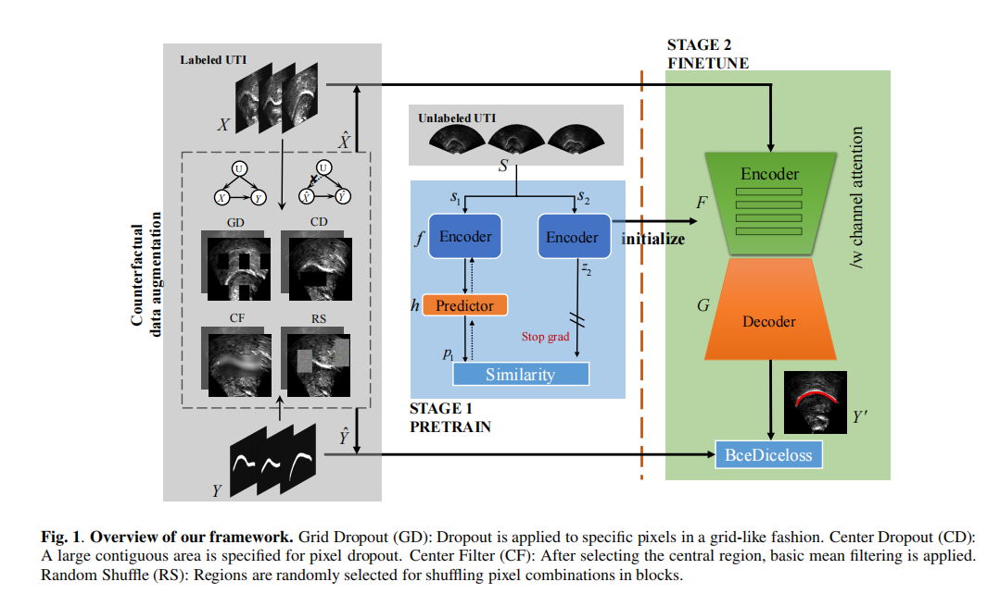
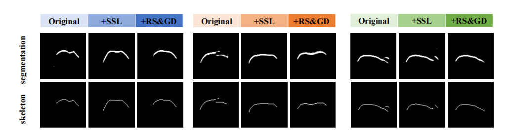

# ultrasound-CounterfactualDA
 SELF-SUPERVISED LEARNING FOR ULTRASOUND TONGUE CONTOUR EXTRACTION WITH COUNTERFACTUAL DATA AUGMENTATION

**Typical sample performance in our method ablation study.** **Original** is the direct output of the backbone network; **+SSL** adds self
supervised pre training; **+RS&GD** adds specific data augmentation based on **+SSL**.
